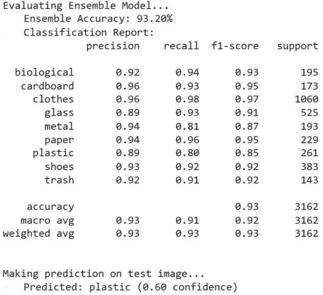

# Garbage Classification with CNN Ensembles

This project implements a Garbage Image Classification system using multiple Convolutional Neural Networks (CNNs) and Transfer Learning.  
Different architectures (Light CNN, Deep CNN, Wide CNN, EfficientNetB3, ResNet50, DenseNet121) are trained and combined into an ensemble for robust classification performance.
This work represents the **software component** of my **Internally Funded Project at SSN College of Engineering**, focusing on intelligent waste management through deep learning.

---

## Features
- Multiple CNN architectures (Light, Deep, Wide)
- Transfer learning with EfficientNetB3, ResNet50, DenseNet121
- Ensemble learning with average and weighted voting
- Training callbacks: ModelCheckpoint, EarlyStopping, ReduceLROnPlateau
- Performance evaluation with accuracy and classification reports
- Single image prediction support
- Configurable dataset path via `.env` file

---

## Tech Stack
- Python
- TensorFlow / Keras
- NumPy
- scikit-learn
- dotenv

---

---

## Project Structure
├── samples/ # Sample test images
│ └── test_image.png
├── main.py # Training and ensemble script
├── requirements.txt # Dependencies
├── .env.example # Environment variables template
└── README.md # Documentation
└── LICENSE # License
└── assests/ # Model Performance
##License

This project is licensed under the Apache 2.0 License.